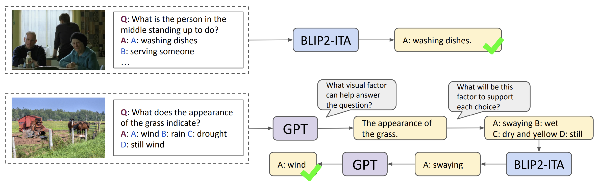
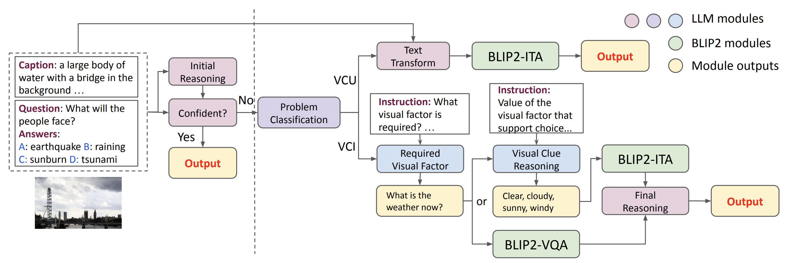

# ViCor

[Kaiwen Zhou](https://kevinz-01.github.io/), [Kwonjoon Lee](https://scholar.google.com/citations?hl=en&user=C6Wu8M0AAAAJ&view_op=list_works), [Teruhisa Misu](https://scholar.google.com/citations?user=4LAT5WYAAAAJ&hl=en), [Xin Eric Wang](https://eric-xw.github.io/)

[[Project Page](https://kevinz-01.github.io/vicor/)] [[Paper](https://arxiv.org/abs/2310.05872)]


## Model Architecture


## Code Release
Coming soon

## Citation


```
@article{zhou2023vicor,
  title={Vicor: Bridging visual understanding and commonsense reasoning with large language models},
  author={Zhou, Kaiwen and Lee, Kwonjoon and Misu, Teruhisa and Wang, Xin Eric},
  journal={arXiv preprint arXiv:2310.05872},
  year={2023}
}
```
